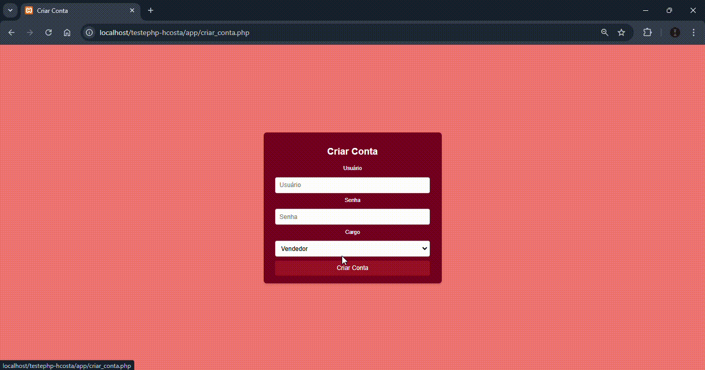

# DOCUMENTAÇÃO TESTEPHP-HCOSTA

## Descrição

Este projeto é a resolução do desafio do processo seletivo para a vaga de programador PHP/Laravel na empresa HCOSTA. 

Consiste na implementação uma aplicação Web utilizando o framework PHP Laravel, e o banco de dados relacional MySQL, desenvolvendo em um ambiente Docker. 

- Data de Início: `02/12/2024`
- Data de Conclusão: `04/12/2024`

Confira o Desafio: [Arquivo-TestePHP.pdf](https://github.com/alanaqueiroz/testephp-hcosta/blob/main/README/Arquivo-TestePHP.pdf)

---

## Demo

Demonstração do projeto funcionando. Exibição da tabela com os dados do banco, logado como cliente, e demonstração das permissões:



---

## Estrutura do Projeto

Aqui está a estrutura de pastas e a explicação de suas funções:

```
/testephp-hcosta
├── app/
│   ├── service.pecas (API REST Laravel)
│   ├── Services/ 
│   │   └── ProductService.php (Configuração Url de consulta de item)
│   ├── cliente.php (Tela CRUD para Editar e Deletar)
│   ├── editar_pedido.php (Tela para edição do status)
│   ├── login.php (Tela de login)
│   ├── logout.php (Deslogar)
│   ├── user_adm.php (Exibição de pedidos para edição de status)
│   ├── vendas.php (Exibição dos pedidos do cliente)
├── docker/
│   ├── nginx/
│   │   └── default.conf
│   ├── php/
│   │   └── Dockerfile
│   ├── docker-compose.yml
├── README/ (Arquivos da documentação)
├── README.md (Documentação)
├── .env (Acesso ao banco)
├── banco.sql (Comandos SQL para criação do Banco de Dadados)
├── docker-compose.yml (Containers)
└── modelagem.mwb (Modelagem do banco por MySQL Workbench)
```

### Detalhes dos Arquivos

1. **docker-compose.yml**  
   Arquivo principal para gerenciar os contêineres. Deve incluir:
   - Um serviço para PHP
   - Um serviço para Nginx
   - Um serviço para MySQL
   - Um serviço para phpMyAdmin

2. **Dockerfile** (dentro de `docker/php/`)  
   Define o ambiente do PHP. Adicione extensões como `pdo_mysql`, `mbstring`, etc.

3. **default.conf** (dentro de `docker/nginx/`)  
   Configuração do Nginx para servir a aplicação Laravel.

---

## Estrutura do Banco de Dados

Representação a modelagem de um sistema de vendas. Ele permite gerenciar usuários, pedidos e produtos, além de relacionar pedidos a produtos específicos.

### Modelagem


Essa modelagem foi desenvolvida no [MySQL WorkBench](https://dev.mysql.com/downloads/workbench/).
 O Arquivo da modelagem se encontra no diretório do projeto com o titulo `modelagem.mwb`


### 1. **Tabela `users`**
Armazena informações sobre os usuários do sistema.

- **Campos:**
  - `id`: Identificador único do usuário (chave primária).
  - `username`: Nome de usuário único.
  - `password`: Senha do usuário.
  - `role`: Papel do usuário (`cliente` ou `vendedor`).
  - `created_at`: Data de criação do registro.
  - `updated_at`: Data da última atualização do registro.

### 2. **Tabela `orders`**
Armazena informações sobre os pedidos realizados pelos clientes.

- **Campos:**
  - `id`: Identificador único do pedido (chave primária).
  - `user_id`: Identificador do usuário que realizou o pedido (chave estrangeira).
  - `status`: Status do pedido (`pendente`, `pago`, `finalizado`).
  - `created_at`: Data de criação do pedido.
  - `updated_at`: Data da última atualização do pedido.

- **Relacionamento:**
  - Relacionado à tabela `users` via `user_id`.
  - **Restrição:** `ON DELETE CASCADE` - Exclui os pedidos se o usuário for removido.

### 3. **Tabela `products`**
Armazena os produtos disponíveis para venda.

- **Campos:**
  - `id`: Identificador único do produto (chave primária).
  - `name`: Nome do produto.
  - `price`: Preço do produto.

### 4. **Tabela `order_products`**
Relaciona pedidos com produtos específicos, permitindo que um pedido tenha múltiplos produtos e quantidades.

- **Campos:**
  - `order_id`: Identificador do pedido (chave estrangeira).
  - `product_id`: Identificador do produto (chave estrangeira).
  - `quantity`: Quantidade de um produto específico no pedido.

- **Relacionamento:**
  - Relacionado à tabela `orders` via `order_id`.
  - Relacionado à tabela `products` via `product_id`.
  - **Restrição:** `ON DELETE CASCADE` - Exclui os relacionamentos se o pedido ou produto for removido.

---

## O que foi aplicado?

Tecnologias: Docker, Laravel, PHP, HTML, CSS, Javascript.

##### CLEAN-CODE: 
- Nomes: Foram usados nomes significativos nas variáveis, funções e classes, refletindo seu propósito claramente.
- Legibilidade: O código possui uma arquitetura facilmente compreensível.
- Comentários: Foram realizados comentários esclarecedores nos códigos.
- Formatação: Código uniforme de forma identada e com espeçamentos, facilitando a leitura.

---

## REGISTRO

Aqui vou deixar um registro das etapas que realizei durante o desenvolvimento do projeto:

### Criação do ambiente Docker

### Configuração do Nginx

Criação do arquivo `docker/nginx/default.conf` certificando que as páginas de início index eram o `login.php` (Meu arquivo inicial)

```nginx
server {
    listen 80;
    index login.php login.html;
    root /var/www/html/public;

    location / {
        try_files $uri $uri/ /login.php?$query_string;
    }

    location ~ \.php$ {
        include fastcgi_params;
        fastcgi_pass app:9000;
        fastcgi_index login.php;
        fastcgi_param SCRIPT_FILENAME $document_root$fastcgi_script_name;
    }

    location ~ /\.ht {
        deny all;
    }
}
```

---

## Requisitos

Para rodar o projeto, certifique-se de ter os seguintes softwares instalados em sua máquina:

1. **Docker**  
   Instale o Docker de acordo com seu sistema operacional:  
   - [Docker Desktop](https://www.docker.com/products/docker-desktop) (Windows/Mac)  
   - [Docker Engine](https://docs.docker.com/engine/install/) (Linux)

2. **Docker Compose**  
   Certifique-se de que o Docker Compose está instalado (normalmente incluído no Docker Desktop).  
   Verifique a instalação executando:
   ```bash
   docker-compose --version
   ```

3. **Composer** (opcional para criar o projeto Laravel localmente antes de usar o Docker)  
   Instale o Composer seguindo as instruções no [site oficial](https://getcomposer.org/).

---

## Acesso ao projeto

Para rodar o projeto, segui os passos a seguir:

### 1. Clone o Repositório

Clonar o projeto:
```bash
git clone https://github.com/alanaqueiroz/testephp-hcosta.git
cd testephp-hcosta
```
### 2. Suba os Contêineres

Execute o seguinte comando na raiz do projeto:
```bash
docker-compose up -d
```

### 3. Crie o banco de dados

No diretório principal desse projeto, há um arquivo SQL com o nome `banco.sql`, nele deixei os comandos necessarios para criar o banco. Rode-os em um gerenciador de banco de dados da sua preferência. Exemplo: [MySQL-Front](https://mysql-front.software.informer.com/download/).

Caso opte por gerar o banco pelo phpMyAdmin, ele fica disponível `localhost:8888`, conforme a porta configurada do arquivo `docker-composer.yml`.

### 4. Rodando o Projeto

- Servidor Local: Você pode visualizar o projeto em um servidor local, por exemplo o [XAMPP](https://www.apachefriends.org/download.html), colocando a pasta do projeto dentro da pasta `htdocs` e acessar a url `http://localhost/testephp-hcosta/app/login.php`. 

---

## Solução de Problemas

1. **Erro de permissões no diretório `storage` ou `bootstrap/cache`**  
   Dentro do contêiner PHP, execute:
   ```bash
   chmod -R 775 storage bootstrap/cache
   chown -R www-data:www-data storage bootstrap/cache
   ```

2. **Problemas ao instalar pacotes com Composer**  
   Certifique-se de estar no contêiner PHP:
   ```bash
   docker exec -it laravel-app bash
   composer install
   ```
   
   Caso veja que o composer não está sendo instalado, verifique se o diretório php esta configurado nas Variáveis do Sistema. Se estiver e mesmo assim continuar, verifique se a versão do Laravel é compatível com seu PHP via terminal:
   ```bash
   php -v
   ```